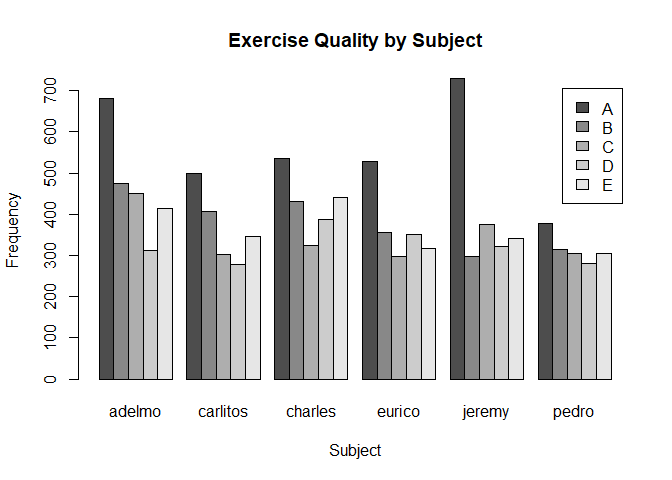
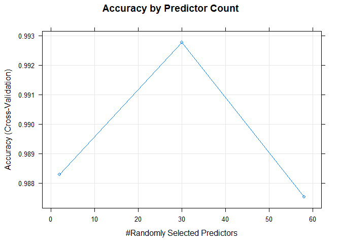
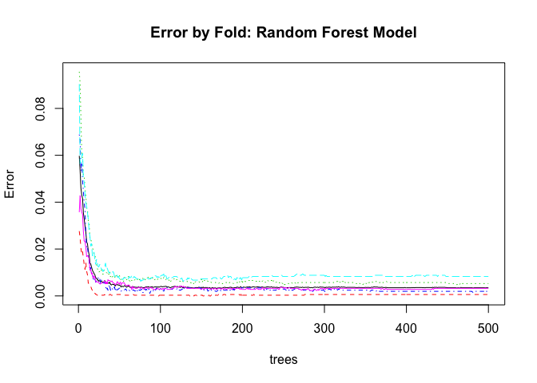
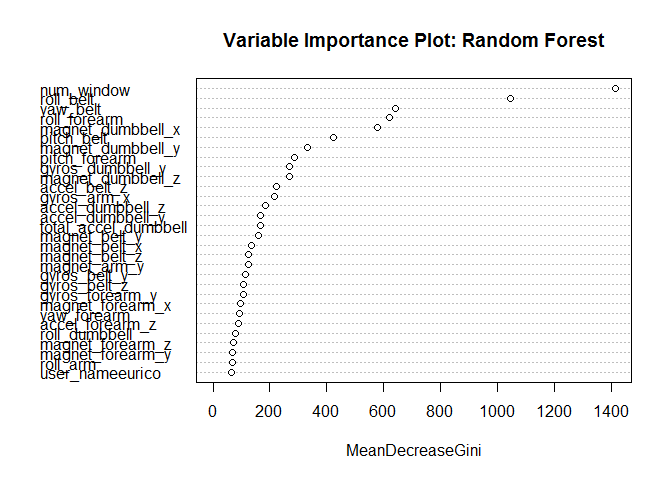

# Quantified Self Project - An Exercise in Machine Learning
Len Greski  
January 31, 2016  


## Executive Summary

Classification of data from the [Qualitative Activity Recognition of Weight Lifting Exercises](https://github.com/lgreski/practicalmachinelearning/blob/gh-pages/2013.Velloso.QAR-WLE.pdf) study to predict exercise quality for unknown observations from the study resulted in a 100% accuracy rate with a random forest technique. Key findings included:

* Fully 62.5% of the data in the dataset was unusable, due to the high rates of missing values,
* Of the remaining 60 variables, 54 were used to predict the values of the quality variable, `classe`, and
* A random forest model with 30 variables achieved 99.71% accuracy, correctly identifying 20 out of 20 unknown test cases. 

## Online Versions

The Github Pages version of this report may be found at [Quantified Self Project - An Exercise in Machine Learning](http://lgreski.github.io/practicalmachinelearning), and is sourced at [Len Greski's Practical Machine Learning Github Repository](https://github.com/lgreski/practicalmachinelearning). 

## Background

There is an explosion of data being generated by personal devices, ranging from smartphones to "wearable" computers and fitness trackers such as the *Fitbit, Jawbone Up, Moto 360, Nike Fuelband, Samsung Gear Fit* and most recently the *Apple Watch*. Scientists are using this data to form an emerging category of research: Human Activity Recognition (HAR). 

While most of the research in HAR is focused on identifying specific types of activities given a set of measurements from a smart device, relatively little attention has been paid to the quality of exercises as measured by these devices. As such, Wallace Uguilino, Eduardo Vellos, and Hugo Fuks developed a study to see whether they could classify the quality of exercises done by a set of six individuals.  

Our goal for this analysis is to use the Weight Lifting Exercises Dataset that was the subject of the research paper [Qualitative Activity Recognition of Weight Lifting Exercises](http://groupware.les.inf.puc-rio.br/work.jsf?p1=11201), which was presented at the 4th Augmented Human (AH) International Conference in 2013. Details about the methodology for specifying correct execution of an exercise and tracking it may be found in the paper linked above. 

## Exploratory Data Analysis / Feature Selection

Per the research team:

> Six young health participants were asked to perform one set of 10 repititions (sic) of the 
> Unilateral Dumbell Biceps Curl in five different fashions: exactly according to the
> specification (Class A), throwing elbows to the front (Class B), lifting the dumbbell
> only halfway (Class C), lowering the dumbbell only halfway (Class D), and throwing the
> hips to the front (Class E).

The independent variables are a list of 153 variables collected from a belt sensor, an arm sensor, a forearm sensor, and a dumbbell sensor. 

The dependent variable, `classe`, is a categorical variable with 16% to 28% of the observations in a given category, as illustrated in the following table.

#### Exercise Classification Frequency Across Subjects


             A      B      C      D      E    
-----------  -----  -----  -----  -----  -----
Count        3348   2279   2054   1930   2165 
Percentage   28%    19%    17%    16%    18%  

Category A represents the exercises that were completed according to specification, approximately 28% of the total number of exercises measured across the six participants in the study. Exercise quality varies significantly within and between persons, as illustrated in the following barplot. 

<!-- -->

A successful classification model will not only predict whether the exercise was completed correctly (classe A vs. B through E), but also correctly classify the type of error made if the exercise was completed in error. For the purposes of our assignment, our machine learning algorithm must predict the values of 20 unknown observations. Therefore, we'll need a model with over 95% accuracy in order to achieve 20 successful classifications for the 20 observations, since the probability of achieving 20 out of 20 correct predictions is $p^{20}$, and $0.95^{20} = 0.36$. At 99% accuracy, we estimate a .80 probability of 20 out of 20 matches.

A run of summary statistics on the independent training dataset shows that 100 of the 160 variables in the data set are missing for all of the observations. We will eliminate these from the analysis because there is no way to devise a meaningful missing value imputation strategy for these variables. We will also remove the date and time variables (`raw_timestamp_part_1`, `raw_timestamp_part_2`, and `cvtd_timestamp`) and `new_window`, because `new_window` was distributed as 2% "yes" and 98% "no".  Therefore it would not likely be a good variable to classify exercises into exercise quality levels. We also include the factor variable representing each individual's name as part of the model, to see whether accounting for within-person variability in the quality of the exercises is of any value in predicting the result. 

All of the remaining numeric variables have no missing values, so imputation of missing values is not required in order to increase the number of features included in the analysis. 

## Cross-Validation & Out of Sample Error Estimation

To balance predictive power with a manageable time to build our models, we will use k-fold cross validation as our method for estimating our out of sample error. We will select 5 folds, meaning that the our classifiation algorithms will group the data into five subsamples, estimating five models where one model is saved as the hold out group while the remaining four subsamples are used to train the model. The results are then aggregated to create an overall estimate of the out of sample error. 

## Model 1: Linear Discriminant Analysis 

We begin the predictive modeling exercise with a simple classification model based on linear discriminant analysis. We chose this approach because it is a relatively simple model that can serve as a baseline for prediction accuracy.  


```
## [1] "Train model1 took:  3.18626594543457 secs"
```

```
## Confusion Matrix and Statistics
## 
##           Reference
## Prediction    A    B    C    D    E
##          A 2857  313  182   99   73
##          B   90 1526  189   78  248
##          C  179  297 1424  253  142
##          D  220   71  228 1479  187
##          E    2   72   31   21 1515
## 
## Overall Statistics
##                                           
##                Accuracy : 0.7474          
##                  95% CI : (0.7394, 0.7552)
##     No Information Rate : 0.2843          
##     P-Value [Acc > NIR] : < 2.2e-16       
##                                           
##                   Kappa : 0.6802          
##  Mcnemar's Test P-Value : < 2.2e-16       
## 
## Statistics by Class:
## 
##                      Class: A Class: B Class: C Class: D Class: E
## Sensitivity            0.8533   0.6696   0.6933   0.7663   0.6998
## Specificity            0.9209   0.9363   0.9104   0.9283   0.9869
## Pos Pred Value         0.8107   0.7161   0.6205   0.6769   0.9232
## Neg Pred Value         0.9405   0.9219   0.9336   0.9530   0.9359
## Prevalence             0.2843   0.1935   0.1744   0.1639   0.1838
## Detection Rate         0.2426   0.1296   0.1209   0.1256   0.1287
## Detection Prevalence   0.2993   0.1810   0.1949   0.1855   0.1394
## Balanced Accuracy      0.8871   0.8029   0.8018   0.8473   0.8433
```

The model has an overall accuracy of 75%, with the highest sensitivity being .85 for classifying an exercise as class A when it is indeed A. The model performs worst on class B, with only 67% sensitivity. The confusion matrix illustrates that a classification model based on linear discriminant analysis does not have sufficient accuracy for us to expect perfect or near-perfect classification of our unknown validation cases.

## Model 2: Random Forest 

The random forest technique generates multiple predictive models, and aggregates them to create a final result. Random forests have a high degree of predictive power, and can be tuned according to a variety of parameters, including a range of choices for estimating out of sample error from k-fold cross validation to leave one out bootstrapping. As we did with the linear discriminant analysis, we use k-fold cross validation with five folds. 


```
##    user  system elapsed 
##   46.21    0.33  377.27
```

```
## Random Forest 
## 
## 11776 samples
##    54 predictor
##     5 classes: 'A', 'B', 'C', 'D', 'E' 
## 
## No pre-processing
## Resampling: Cross-Validated (5 fold) 
## Summary of sample sizes: 9420, 9421, 9420, 9423, 9420 
## Resampling results across tuning parameters:
## 
##   mtry  Accuracy   Kappa    
##    2    0.9910838  0.9887205
##   30    0.9953294  0.9940922
##   58    0.9923575  0.9903324
## 
## Accuracy was used to select the optimal model using the largest value.
## The final value used for the model was mtry = 30.
```

```
## [1] "Train model2 took:  6.29260436693827 mins"
```

```
## Confusion Matrix and Statistics
## 
##           Reference
## Prediction    A    B    C    D    E
##          A 3348    0    0    0    0
##          B    0 2279    0    0    0
##          C    0    0 2054    0    0
##          D    0    0    0 1930    0
##          E    0    0    0    0 2165
## 
## Overall Statistics
##                                      
##                Accuracy : 1          
##                  95% CI : (0.9997, 1)
##     No Information Rate : 0.2843     
##     P-Value [Acc > NIR] : < 2.2e-16  
##                                      
##                   Kappa : 1          
##  Mcnemar's Test P-Value : NA         
## 
## Statistics by Class:
## 
##                      Class: A Class: B Class: C Class: D Class: E
## Sensitivity            1.0000   1.0000   1.0000   1.0000   1.0000
## Specificity            1.0000   1.0000   1.0000   1.0000   1.0000
## Pos Pred Value         1.0000   1.0000   1.0000   1.0000   1.0000
## Neg Pred Value         1.0000   1.0000   1.0000   1.0000   1.0000
## Prevalence             0.2843   0.1935   0.1744   0.1639   0.1838
## Detection Rate         0.2843   0.1935   0.1744   0.1639   0.1838
## Detection Prevalence   0.2843   0.1935   0.1744   0.1639   0.1838
## Balanced Accuracy      1.0000   1.0000   1.0000   1.0000   1.0000
```

```
## Predict & estimate out of sample error on data held back from training data set.
```

```
## Confusion Matrix and Statistics
## 
##           Reference
## Prediction    A    B    C    D    E
##          A 2231    8    0    0    0
##          B    0 1509    6    0    0
##          C    0    1 1362    3    0
##          D    0    0    0 1283    6
##          E    1    0    0    0 1436
## 
## Overall Statistics
##                                           
##                Accuracy : 0.9968          
##                  95% CI : (0.9953, 0.9979)
##     No Information Rate : 0.2845          
##     P-Value [Acc > NIR] : < 2.2e-16       
##                                           
##                   Kappa : 0.996           
##  Mcnemar's Test P-Value : NA              
## 
## Statistics by Class:
## 
##                      Class: A Class: B Class: C Class: D Class: E
## Sensitivity            0.9996   0.9941   0.9956   0.9977   0.9958
## Specificity            0.9986   0.9991   0.9994   0.9991   0.9998
## Pos Pred Value         0.9964   0.9960   0.9971   0.9953   0.9993
## Neg Pred Value         0.9998   0.9986   0.9991   0.9995   0.9991
## Prevalence             0.2845   0.1935   0.1744   0.1639   0.1838
## Detection Rate         0.2843   0.1923   0.1736   0.1635   0.1830
## Detection Prevalence   0.2854   0.1931   0.1741   0.1643   0.1832
## Balanced Accuracy      0.9991   0.9966   0.9975   0.9984   0.9978
```

The random forest model is extremely powerful, correctly classifying all cases in our training data set. When applied to the 40% holdout from the training data, the accuracy is .9968, very close to the 1.0 accuracy that was obtained with the 5 fold cross validation against the 60% sample of the training data. The algorithm produces optimal results with 30 predictors, reaching a maximum accuracy of approximately 0.995 as illustrated by the following chart. 

<!-- -->

The final model selected by the algorithm quickly minimizes the error term, stabilizing below 0.02 after approximately 50 trees. As trees are added beyond 50, they do not appear to meaningfully reduce the error. There is also little variability in the error term across folds, as illustrated by the following plot. 

<!-- -->

The relative importance of the variables is illustrated by the following variable importance plot. The seven most important variables include `num_window`, `roll_belt`, `pitch_forearm`, `yaw_belt`, `magnet_drumbell_z`, `magnet_drumbell_y`, and `pitch_belt`, each of which decreases the mean node impurity by at least 500, whereas the remaining variables decrease node impurity by less than 500, using the summed and normalized Gini Coefficient. See [Dinsdale and Edwards \(2015\)](https://dinsdalelab.sdsu.edu/metag.stats/code/randomforest.html) for additional background on the Gini Coefficient in the random forest variable importance.  

<!-- -->

### Expected Out of Sample Error

Given the accuracy level achieved via cross-validation of the model against multiple folds of the training data set, we expect the out of sample error rate to be less than 1%. Therefore, we estimate a 0.936 probability that we will correctly classify all 20 of the validation cases.  

## Results

The results from our random forest model were excellent. Applying the model to the test data set that we held out of of the model building steps, we find that the model accurately predicts 99.68% of the test cases, incorrectly classifying only 23 of the 7,846 observations. The error rate for the test data set is only 0.32%, giving us a .938 probability that the model would correctly classify all 20 validation cases. 

Finally, our accuracy at predicting the 20 cases in the validation data set was 100%.  All in all, a good effort for our first attempt at a random forest. 

## Appendix

Note that a run of the Microsoft Word word counter on the narrative text in this report (counting text before the start of the Appendix section) results in a count of 1,353 words, well under the 2,000 word limit for the report. 


```r
theFiles <- c("pml-testing.csv","pml-training.csv")
theDirectory <- "./data/"
dlMethod <- "curl"
if(substr(Sys.getenv("OS"),1,7) == "Windows") dlMethod <- "wininet"
if(!dir.exists(theDirectory)) dir.create(theDirectory)
for (i in 1:length(theFiles)) {
     aFile <- paste(theDirectory,theFiles[i],sep="")
     if (!file.exists(aFile)) {
          url <- paste("https://d396qusza40orc.cloudfront.net/predmachlearn/",
                       theFiles[i],
                       sep="")
          download.file(url,destfile=aFile,
                        method=dlMethod,
                        mode="w") # use mode "w" for text 
     }
}
```


```r
library(lattice,quietly=TRUE)
library(MASS,quietly=TRUE)
library(ggplot2,quietly=TRUE)
library(grid,quietly=TRUE)
library(readr,quietly=TRUE)
library(knitr,quietly=TRUE)
library(caret,quietly=TRUE)
library(YaleToolkit,quietly=TRUE)
string40 <-  "ncnnccnnnnnnnnnnnnnnnnnnnnnnnnnnnnnnnnnn"
string80 <-  "nnnnnnnnnnnnnnnnnnnnnnnnnnnnnnnnnnnnnnnn"
string120 <- "nnnnnnnnnnnnnnnnnnnnnnnnnnnnnnnnnnnnnnnn"
string160 <- "nnnnnnnnnnnnnnnnnnnnnnnnnnnnnnnnnnnnnnnc"
colString <- paste(string40,string80,string120,string160,sep="")

validation <- readr::read_csv("./data/pml-testing.csv",
     col_names=TRUE,
     col_types=colString)
originalData <- readr::read_csv("./data/pml-training.csv",
     col_names=TRUE,
     col_types=colString)
# fix missing colunm name for "observation / row number"
theColNames <- colnames(originalData)
theColNames[1] <- "obs"
colnames(originalData) <- theColNames

originalData$classe <- as.factor(originalData$classe)
valResult <- whatis(originalData)
# retain all columns with fewer than 50 missing values
theNames <- as.character(valResult[valResult$missing < 50 & valResult$variable.name != "obs",1])
originalSubset <- originalData[,theNames]
# remove date variables and binary window 
originalSubset <- originalSubset[c(-2,-3,-4,-5)]
# valSubset <- whatis(originalSubset)
set.seed(102134)
trainIndex <- createDataPartition(originalSubset$classe,p=.60,list=FALSE)
training <- originalSubset[trainIndex,]
testing <- originalSubset[-trainIndex,]
```


```r
library(iterators,quietly=TRUE)
library(parallel,quietly=TRUE)
library(foreach,quietly=TRUE)
library(doParallel,quietly=TRUE)
cluster <- makeCluster(detectCores()-1)
registerDoParallel(cluster)
```


```r
yvars <- training[,55]
xvars <- training[,-55]
intervalStart <- Sys.time()
mod1Control <- trainControl(method="cv",number=5,allowParallel=TRUE)
# modFit1 <- train(x=xvars,y=yvars,method="rpart",trControl=mod1Control)
modFit1 <- train(classe ~ .,data=training,method="lda",trControl=mod1Control)
# Model 1
intervalEnd <- Sys.time()
paste("Train model1 took: ",intervalEnd - intervalStart,attr(intervalEnd - intervalStart,"units"))
pred1 <- predict(modFit1,training)
confusionMatrix(pred1,training$classe)
# predicted_test <- predict(modFit1,testing)
# confusionMatrix(predicted_test,testing$classe)
# predicted_validation <- predict(modFit,validation)
```


```r
suppressPackageStartupMessages(library(randomForest,quietly=TRUE))
intervalStart <- Sys.time()
mod2Control <- trainControl(method="cv",number=5,allowParallel=TRUE)
system.time(modFit2 <- train(classe ~ .,data=training,method="rf",trControl=mod2Control))
intervalEnd <- Sys.time()
print(modFit2)
paste("Train model2 took: ",intervalEnd - intervalStart,attr(intervalEnd - intervalStart,"units"))
                                                                
 
pred2 <- predict(modFit2,training)
 
confusionMatrix(pred2,training$classe)
message("Predict & estimate out of sample error on data held back from training data set.") 
predicted_test <- predict(modFit2,testing)
confusionMatrix(predicted_test,testing$classe)
```


```r
# generate predictions on validation data set 
predicted_validation <- predict(modFit2,validation)
# compare to correct answers as validated by submitting the individual files to Coursera for
# part 2 of the assignment 
answers <- c("B" ,"A","B","A", "A","E", "D", "B", "A", "A",
             "B", "C", "B", "A", "E", "E", "A", "B", "B", "B")
results <- data.frame(answers,predicted_validation)
which(as.character(results$answers) != as.character(results$predicted_validation))


pml_write_files = function(x){
  n = length(x)
  for(i in 1:n){
    filename = paste("./data/problem_id_",i,".txt")
    write.table(x[i],file=filename,quote=FALSE,row.names=FALSE,col.names=FALSE)
  }
}
predicted_chars <- as.character(predicted_validation)
pml_write_files(predicted_chars)
```


```r
sessionInfo()
```

```
## R version 3.4.2 (2017-09-28)
## Platform: x86_64-w64-mingw32/x64 (64-bit)
## Running under: Windows 10 x64 (build 15063)
## 
## Matrix products: default
## 
## locale:
## [1] LC_COLLATE=English_United States.1252 
## [2] LC_CTYPE=English_United States.1252   
## [3] LC_MONETARY=English_United States.1252
## [4] LC_NUMERIC=C                          
## [5] LC_TIME=English_United States.1252    
## 
## attached base packages:
## [1] parallel  grid      stats     graphics  grDevices utils     datasets 
## [8] methods   base     
## 
## other attached packages:
##  [1] randomForest_4.6-12 doParallel_1.0.11   foreach_1.4.3      
##  [4] iterators_1.0.8     YaleToolkit_4.2.2   caret_6.0-77.9000  
##  [7] knitr_1.17          readr_1.1.1         ggplot2_2.2.1      
## [10] MASS_7.3-47         lattice_0.20-35    
## 
## loaded via a namespace (and not attached):
##  [1] Rcpp_0.12.13       lubridate_1.6.0    tidyr_0.7.2       
##  [4] class_7.3-14       assertthat_0.2.0   rprojroot_1.2     
##  [7] digest_0.6.12      ipred_0.9-6        psych_1.7.8       
## [10] R6_2.2.2           plyr_1.8.4         backports_1.1.1   
## [13] stats4_3.4.2       e1071_1.6-8        evaluate_0.10.1   
## [16] highr_0.6          rlang_0.1.2        lazyeval_0.2.0    
## [19] kernlab_0.9-25     rpart_4.1-11       Matrix_1.2-11     
## [22] rmarkdown_1.6      splines_3.4.2      CVST_0.2-1        
## [25] ddalpha_1.3.1      gower_0.1.2        stringr_1.2.0     
## [28] foreign_0.8-69     munsell_0.4.3      broom_0.4.2       
## [31] compiler_3.4.2     pkgconfig_2.0.1    mnormt_1.5-5      
## [34] dimRed_0.1.0       htmltools_0.3.6    nnet_7.3-12       
## [37] tidyselect_0.2.2   tibble_1.3.4       prodlim_1.6.1     
## [40] DRR_0.0.2          codetools_0.2-15   RcppRoll_0.2.2    
## [43] withr_2.0.0        dplyr_0.7.4        recipes_0.1.0.9000
## [46] ModelMetrics_1.1.0 nlme_3.1-131       gtable_0.2.0      
## [49] magrittr_1.5       scales_0.5.0       stringi_1.1.5     
## [52] reshape2_1.4.2     bindrcpp_0.2       timeDate_3012.100 
## [55] robustbase_0.92-7  lava_1.5.1         tools_3.4.2       
## [58] glue_1.1.1         DEoptimR_1.0-8     purrr_0.2.4       
## [61] sfsmisc_1.1-1      hms_0.3            survival_2.41-3   
## [64] yaml_2.1.14        colorspace_1.3-2   bindr_0.1
```

# References

1. Dinsdale, L. and Edwards, R. (2015) -- [Random Forests Webpage](https://dinsdalelab.sdsu.edu/metag.stats/code/randomforest.html), retrieved from the _Metagenomics. Statistics._ website on December 19, 2015. 

2. Velloso, E. et. al. (2013) -- [Qualitative Activity Recognition of Weight Lifting Exercises](http://groupware.les.inf.puc-rio.br/work.jsf?p1=11201), Proceedings of the 4th International Conference in Cooperation with SIGCHI (Augumented Human '13), Stuttgart, Germany, ACM SIGCHI, 2013.


